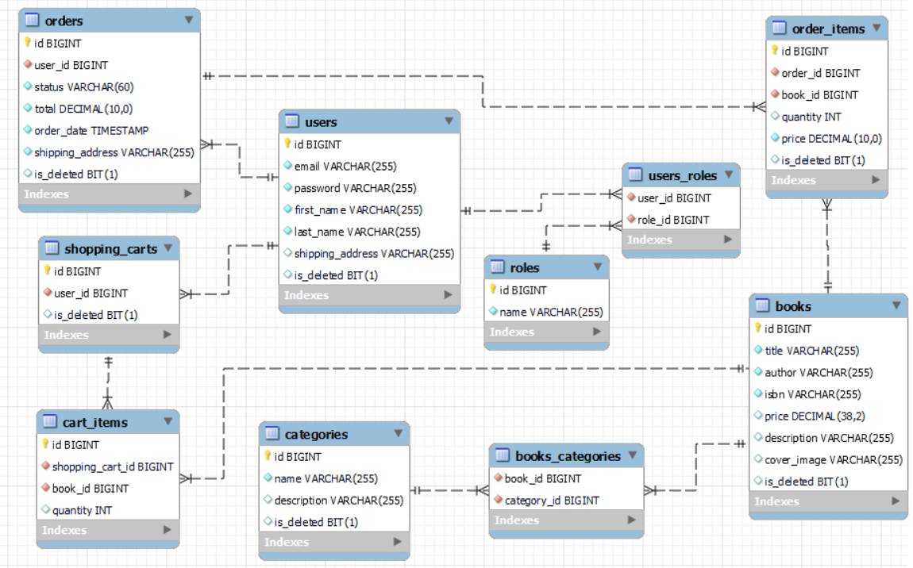

## Introduction
The Online Book Store project was developed to allow users to use the library's functionality directly from their devices. 
The project has implemented features that can be used by users with User privileges, and administrators with Admin privileges. 
This is exactly how most online bookstores work, and now you can also test similar functionality!

## Used technologies and tools:
- **Spring Boot** - 
A framework for creating self-contained, production-ready Spring applications with a minimum of configuration. 
It simplifies the configuration and customization of the application, allowing to quickly start development.
- **Spring Security** - 
A framework for ensuring security in Spring applications. 
It provides tools for user authentication and authorization, HTTP request security, 
and integration with other security systems.
- **Spring Data JPA** - A part of the Spring ecosystem that simplifies database management using the Java Persistence API (JPA). 
It allows to easily create repositories for data access and automatically generates the necessary SQL queries.
- **Swagger** - A tool for documenting and testing REST APIs. 
It generates interactive documentation that allows developers to easily view and test APIs directly 
from the web interface.
- **Docker** - A platform for containerizing applications. 
It allows to package applications and all their dependencies in containers, 
which ensures their independence from the environment and facilitates deployment on different platforms.
- **Liquibase** - A tool for managing the database schema. 
It allows to track changes in the database, manage schema versions, and automate database migration processes
in different environments.
- **MySQL** - A popular open source relational database used to store and manage data in applications. 
It provides high performance, reliability, and scalability.

## Functionalities of controllers
### Authentication controller
| HTTP Request                             | Endpoint             | Description            |
|------------------------------------------|----------------------|------------------------|
| POST | `/auth/registration` | Register a new user    |
| POST | `/auth/login`        | Login an existing user |

### Book controller
| HTTP Request                             | Endpoint        | Description                                          |
|------------------------------------------|-----------------|------------------------------------------------------|
| GET   | `/books`        | Get a list of all available books                    |
| POST | `/books`        | Create a new book and save it to the DB              |
| GET   | `/books/search` | Search books by specific parameters (authors/titles) |
| GET   | `/books/{id}`   | Get one book according to its ID                     |
| PUT    | `/books/{id}`   | Update an existing book from DB by its ID            |
| DELETE  | `/books/{id} `  | Delete one book from DB according to its ID          |

### Category controller
| HTTP Request                             | Endpoint                 | Description                               |
|------------------------------------------|--------------------------|-------------------------------------------|
| POST | `/categories`            | Create a new category                     |
| GET   | `/categories`            | Get a list of all categories              |
| GET   | `/categories/{id}`       | Get one category according to its ID      |
| PUT    | `/categories/{id}`       | Update an existing category by its ID     |
| DELETE  | `/categories/{id}`       | Delete one category according to its ID   |
| GET   | `/categories/{id}/books` | Get list of books by specific category ID |

### Order controller
| HTTP Request                              | Endpoint                           | Description                            |
|-------------------------------------------|------------------------------------|----------------------------------------|
| POST  | `/orders`                          | Place order using shipping address     |
| GET    | `/orders`                          | Get all users orders                   |
| PATCH | `/orders/{id}`                     | Update orders status by its ID         |
| GET    | `/orders/{orderId}/items/{itemId}` | Get order item by its ID and orders ID |
| GET    | `/orders/{orderId}/items`          | Get order items by orders ID           |

### Shopping cart controller
| HTTP Request                             | Endpoint           | Description                                      |
|------------------------------------------|--------------------|--------------------------------------------------|
| GET   | `/cart`            | Get a content of shopping cart                   |
| POST | `/cart`            | Add book to shopping cart                        |
| PUT    | `/cart/items/{id}` | Update quantity of one specific book in the cart |
| DELETE  | `/cart/items/{id}` | Delete cart item from users shopping cart        |

## Database structure:

## Faced challenges
- Authentication problem
> When I was finishing up the Authentication implementation, 
> I encountered a problem that kept throwing an Expired or invalid JWT token error. 
> When I tried to log in a user, as a response I was supposed to receive a token that would be used to send other user requests. 
> The main reason for the problem was that I needed to use the prefix `ROLE_ADMIN`, `ROLE_USER`. 
> Otherwise, Spring can't find any users with the appropriate roles in the database, that is why the error is thrown.
- Docker problem
> When setting up the Docker, I had a problem that when I performed `docker-compose up`, my project was trying to get up endlessly. 
> The main reason for this was that it took more time to start and initialize the MySql database. 
> That is, the application was running faster than the DB, which caused a lot of errors. 
> Therefore, for the first build, you should launch the database first, and then the application. 
> You should also make sure that everything is working properly in Liquibase. 
> After all, there could be errors such as mismatched column types and other things that could interfere with the formation of the DB.

## How to set up and use this project using Docker:
1. Install [Docker](https://www.docker.com/products/docker-desktop/).
2. Clone [THIS](https://github.com/margosalii/online-book-store) repository.
3. Configure `.env` file with all the necessary environment variables.
4. Build the project by command `mvn clean install`.
5. Run the command `docker-compose up --build` to build and launch containers.
*WARN! Sometimes it takes more time for MySqlDB to load. Wait for some seconds*.
6. Access the Swagger UI at http://localhost:8081/swagger-ui/index.html and test the application any way you want!

***Addiction.** If you don't open Docker and just run application with IDE - access it at http://localhost:8080*
## Postman requests collection
If you want to see and test how correctly send requests to Online Book Store, 
[there](https://go.postman.co/workspace/d2b993a8-5808-4b3d-8c48-a458643da804) are collection of requests that you can inspect using Postman.

## This project was deployed on AWS. Therefore, everyone can test it [here](http://ec2-54-172-194-197.compute-1.amazonaws.com/swagger-ui/index.html#/).

